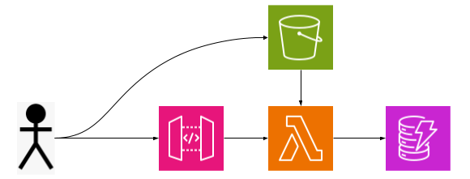

# s3-document-service

A model pre-signed upload/download document service with events and metadata

## Architecture

## Database

DynamoDB

### Access Patterns

1. Get Document by `id`
2. Get All Documents by Company (tenant)

### Keys

PartitionKey: `companyId`
SortKey: `id` (ulid)

## File Storage

S3
