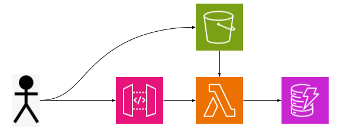

# S3-document-service

A model pre-signed upload/download document service with events and metadata

## Installation/Deployment

```bash
npm ci
npx sls deploy # Needs AWS credentials somewhere
```

## Testing

```bash
npm ci
npm t # to run unit tests
npm run test:int # to run pre-deploy integration tests
npm run test:e2e # to run post-deploy end-to-end tests
```

## Deployed environment

The `dev` stack is left deployed between CI runs rather than torn down after
each one, which is safe because the API requires IAM auth (below). A weekly
[teardown workflow](.github/workflows/teardown.yml) removes it so the next
push exercises a cold create, not just an update.

## Authorization

The HTTP API is protected with IAM authorization (`authorizer: type: aws_iam`),
so every request must be SigV4-signed by a caller holding `execute-api:Invoke`
on the endpoint. Note this protects the _API_; the pre-signed S3 links it hands
back are separately time-limited and are used unsigned.

## Architecture



### To upload a file

1.  User requests an upload link from API Gateway
2.  User receives pre-signed upload link (good for 10 minutes)
3.  User uploads file directly to S3
4.  S3 raises a "File Created" event
5.  Lambda handles the S3 event and writes metadata to DynamoDB

### To download a file

1.  User requests file information from API Gateway
2.  User receives the file metadata which includes a pre-signed download link (good for 7 days)
3.  User downloads file directly from S3

## Database

DynamoDB

### Access Patterns

1. Get Document by `id`
2. Get All Documents by Company (tenant)

### Keys

PartitionKey: `companyId`
SortKey: `id` (ulid)

## File Storage

S3

### Keys

`[companyId]/[documentId]`
